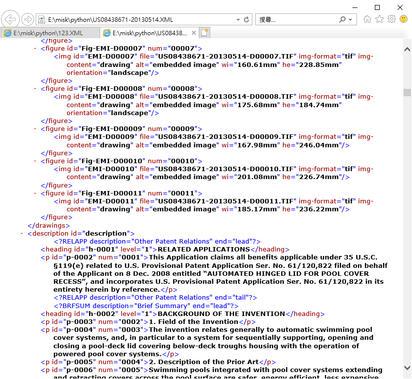
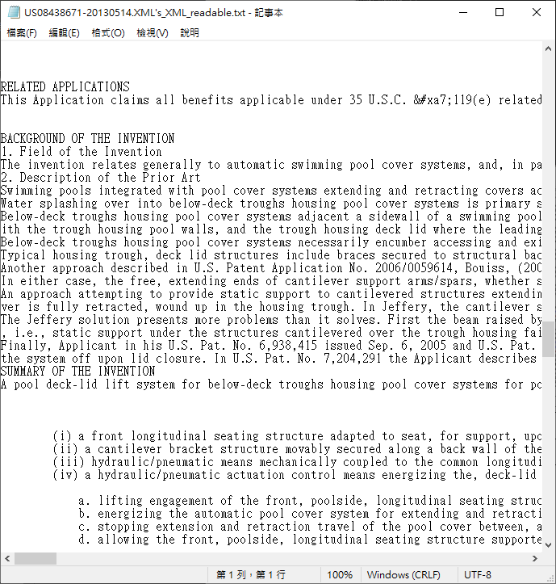
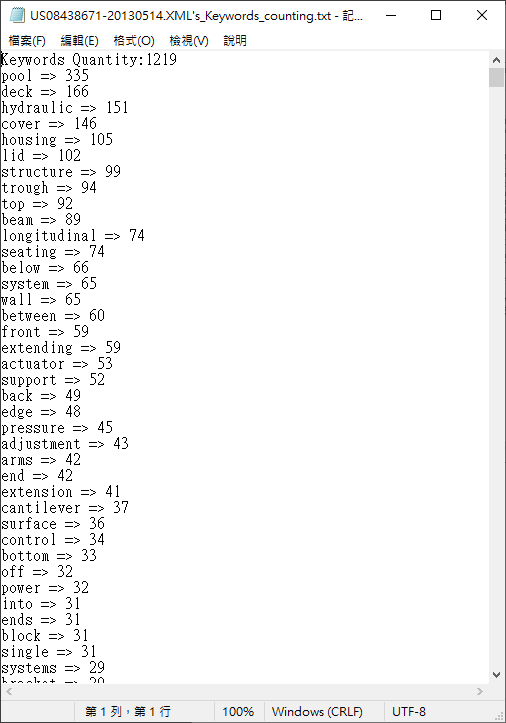
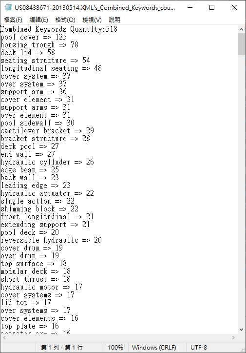

# US Patent document XML tag remove and keywords counting python script.


#### requirements:
    python 3

#### Introduction
Using regular expression to remove XML tag and count keyword in US patent document.

script.py : main program.  
comman_words.txt : Text file including some comman vocabularies that won't count in program. You can add any text in this file to let program ignore it.  


#### usage:
Run the script.py under command line.  
```bash
python script.py {xml_file}
```

After running the script, it will generate 3 new files under the directory.  

* ***{XML_file_name}*'s_XML_readable.txt**: A file including the original XML content but without XML tag.  

* ***{XML_file_name}*'s_Keywords_counting.txt**:A file with Keywords count.  

* ***{XML_file_name}*'s_Combined_Keywords_counting.txt**:A file with combined keywords count.  

#### result

Original XML file:  


Tag Removed:  


Keywords Count:  


Combined Keywords count:  
